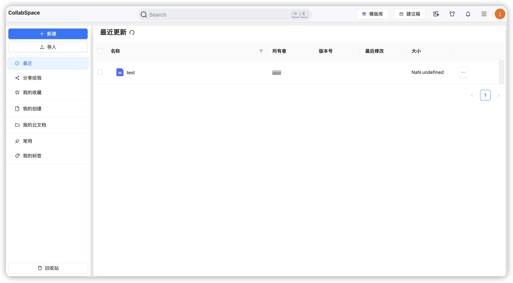
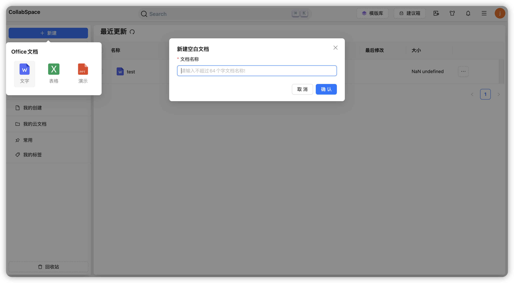
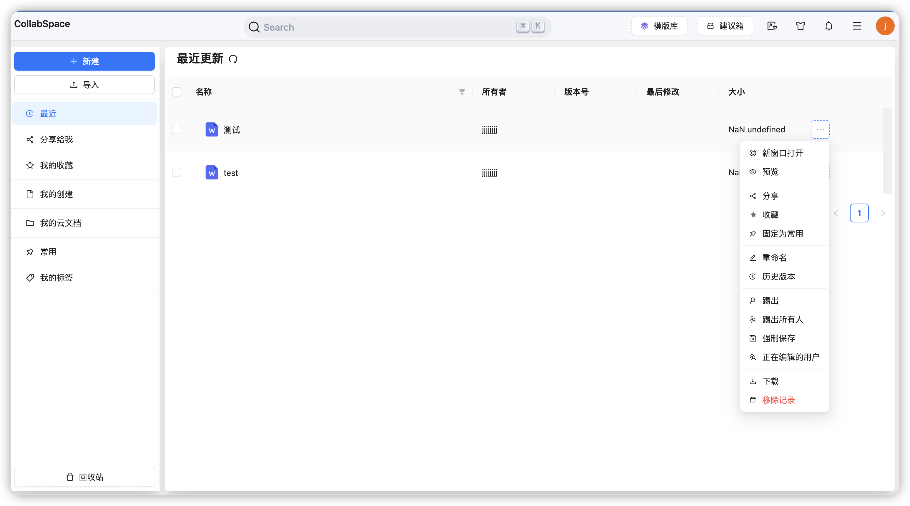
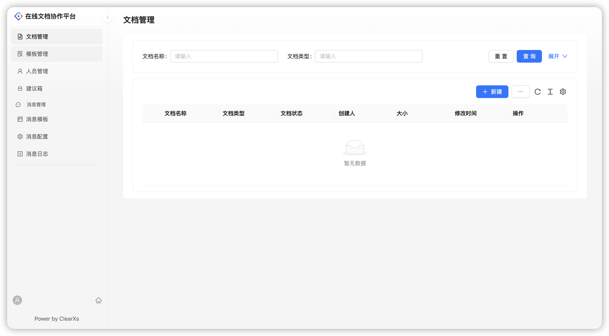

<h2 align="center">简约 · 实用 · 前沿 · 创新</h2>

## 概要

CollabSpace 是一个私有化在线文档协作空间，提供了在线文档查看，编辑，以及协同，它封装了onlyoffice，并在其作为底层核心的基础上，增加Web端以及管理端，为需要私有化在线文档协作提供了可选项。

- 👉[编辑器](https://github.com/ClearXs/office-editor.git)
- 👉[服务端](https://github.com/ClearXs/office-service.git)
- 👉[Web端](https://github.com/ClearXs/office-web.git)

## 界面预览

<table>
    <tr>
        <td></td>
        <td></td>
        <td></td>
    </tr>
    <tr>
        <td></td>
    </tr>
</table>
